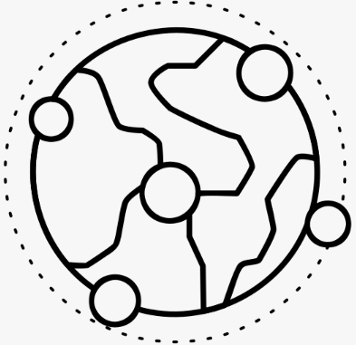
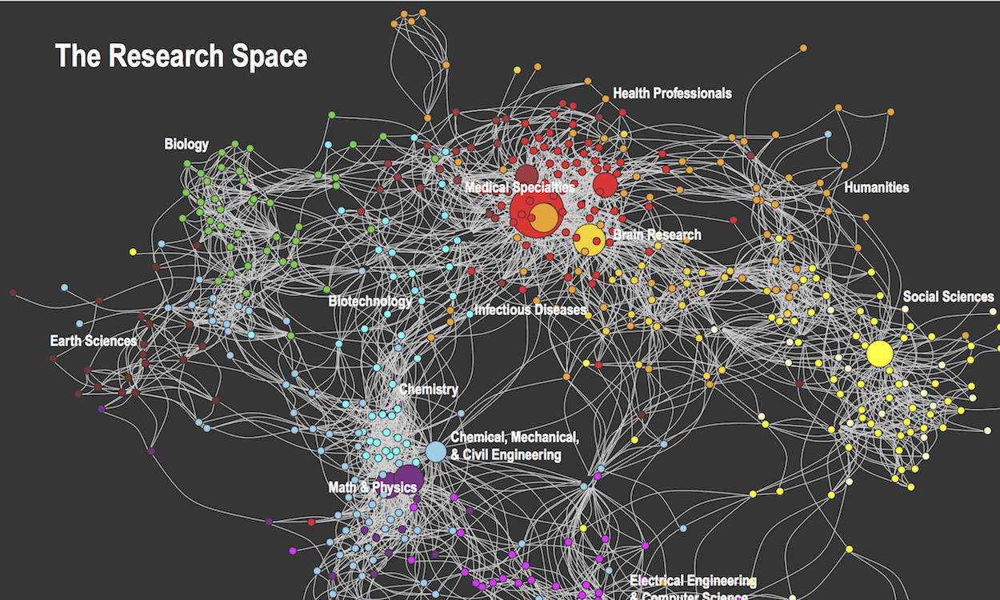
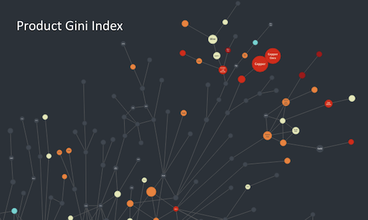

import React from "react";

function App() {
  return (
    

      <header>
      {/* Navbar */}
      <nav className="navbar bg-gradient-to-r from-blue-500 to-indigo-500 text-white shadow-lg justify-center">
        

          
          <a className="btn btn-ghost normal-case text-2xl font-bold">DatosLab</a>
        

        

          <ul className="menu menu-horizontal px-1">
            <li>
              <a className="hover:text-gray-300">Acerca de</a>
            </li>
            <li>
              <a className="hover:text-gray-300">Líneas</a>
            </li>
            <li>
              
              

                
Temas

                <ul className="bg-white text-black rounded-box shadow-lg">
                  <li>
                    <a className="hover:bg-gray-100">Open Data</a>
                  </li>
                  <li>
                    <a className="hover:bg-gray-100">Data Analytics</a>
                  </li>
                  <li>
                    <a className="hover:bg-gray-100">Networks</a>
                  </li>
                  <li>
                    <a className="hover:bg-gray-100">Data Visualization</a>
                  </li>
                </ul>
              

            </li>
            <li>
              <a className="hover:text-gray-300">Publicaciones</a>
            </li>
            <li>
              <a className="hover:text-gray-300">Proyectos</a>
            </li>
            <li>
              <a className="hover:text-gray-300">Contacto</a>
            </li>
          </ul>
        

        

        <label className="flex cursor-pointer gap-2">
  

  <input
    type="radio"
    name="theme-buttons"
    className="btn theme-controller join-item"
    aria-label="Default"
    value="default" />
    <input
    type="radio"
    name="theme-buttons"
    className="btn theme-controller join-item"
    aria-label="dark"
    value="dark" />
  <input
    type="radio"
    name="theme-buttons"
    className="btn theme-controller join-item"
    aria-label="Retro"
    value="retro" />
  <input
    type="radio"
    name="theme-buttons"
    className="btn theme-controller join-item"
    aria-label="Aqua"
    value="aqua" />

</label>
        

      </nav>
      </header>
      {/* Main Content */}
      <section
  className="p-10 text-center"
  style={{ backgroundColor: "#f3f4f6" }}
>
  

    <h1 className="text-4xl font-bold mb-5 text-blue-600">
      Cómo hacer simple la complejidad de los datos
    </h1>
    

      Nuestro laboratorio encuentra patrones y valor en datos interrelacionados -y abundantes- a través de nuevos métodos y visualizaciones
    

    <a
      href="#"
      className="btn btn-primary text-white font-bold py-2 px-4 rounded-lg shadow-lg"
    >
      COMENZAR!
    </a>
  

</section>
      <body>
      <section
          className="p-10 text-center bg-gradient-to-r from-blue-500 to-indigo-500 text-white shadow-lg"
          id="Acerca de"
        >
          

            <h1 className="text-4xl font-bold mb-5">
              Somos el laboratorio de Data Science de la Facultad de Ingeniería en la Universidad de Playa Ancha
            </h1>
            

              Nuestra investigación se aplica a temáticas diversas y con orientación social.
            

            <a
              className="text-white underline"
              href="https://orcid.org/0000-0002-2319-5184"
              target="_blank"
              rel="noopener noreferrer"
            >
              Miguel R. Guevara
            </a>
          

        </section>

          <section>
            

        <h2 className="text-4xl font-bold text-center mb-5">Líneas de Investigación</h2>
        

          

            
            <h3 className="text-2xl font-bold text-blue-500">Open Data</h3>
            

              Datos abiertos y su impacto en la sociedad
            

          

            

            
              <h3 className="text-2xl font-bold text-blue-500">Data Analytics</h3>
              

                Análisis de datos y su aplicación en la toma de decisiones
              

            

            

            
              <h3 className="text-2xl font-bold text-blue-500">Networks</h3>
              

                Redes complejas y su aplicación en la vida real
              

            

            

            
              <h3 className="text-2xl font-bold text-blue-500">Data Visualization</h3>
              

                Visualización de datos y su impacto en la comunicación
              

            

          

        

      </section>
      <section>
      

        <h2 className="text-4xl font-bold text-center mb-5">Publicaciones</h2>
        

          {/* Imagen 1 */}
          
          {/* Imagen 2 */}
          
          {/* Imagen 3 */}
          
          {/* Imagen 4 */}
          
        

      

    </section>
    <section>
      
    </section>
      </body>
      {/* Footer */}

            <footer className="footer footer-center bg-primary text-primary-content p-10">
        <aside>
          
          

            Universidad de Playa Ancha
             
            Fundada el 1 de abril de 1948
          

          
DatosLab © {new Date().getFullYear()} - All rights reserved

        </aside>
        <nav>
          

            <a>
              <svg
                xmlns="http://www.w3.org/2000/svg"
                width="24"
                height="24"
                viewBox="0 0 24 24"
                className="fill-current">
                <path
                  d="M24 4.557c-.883.392-1.832.656-2.828.775 1.017-.609 1.798-1.574 2.165-2.724-.951.564-2.005.974-3.127 1.195-.897-.957-2.178-1.555-3.594-1.555-3.179 0-5.515 2.966-4.797 6.045-4.091-.205-7.719-2.165-10.148-5.144-1.29 2.213-.669 5.108 1.523 6.574-.806-.026-1.566-.247-2.229-.616-.054 2.281 1.581 4.415 3.949 4.89-.693.188-1.452.232-2.224.084.626 1.956 2.444 3.379 4.6 3.419-2.07 1.623-4.678 2.348-7.29 2.04 2.179 1.397 4.768 2.212 7.548 2.212 9.142 0 14.307-7.721 13.995-14.646.962-.695 1.797-1.562 2.457-2.549z"></path>
              </svg>
            </a>
            <a>
              <svg
                xmlns="http://www.w3.org/2000/svg"
                width="24"
                height="24"
                viewBox="0 0 24 24"
                className="fill-current">
                <path
                  d="M19.615 3.184c-3.604-.246-11.631-.245-15.23 0-3.897.266-4.356 2.62-4.385 8.816.029 6.185.484 8.549 4.385 8.816 3.6.245 11.626.246 15.23 0 3.897-.266 4.356-2.62 4.385-8.816-.029-6.185-.484-8.549-4.385-8.816zm-10.615 12.816v-8l8 3.993-8 4.007z"></path>
              </svg>
            </a>
            <a>
              <svg
                xmlns="http://www.w3.org/2000/svg"
                width="24"
                height="24"
                viewBox="0 0 24 24"
                className="fill-current">
                <path
                  d="M9 8h-3v4h3v12h5v-12h3.642l.358-4h-4v-1.667c0-.955.192-1.333 1.115-1.333h2.885v-5h-3.808c-3.596 0-5.192 1.583-5.192 4.615v3.385z"></path>
              </svg>
            </a>
          

        </nav>
      </footer>
    

  );
}

export default App;